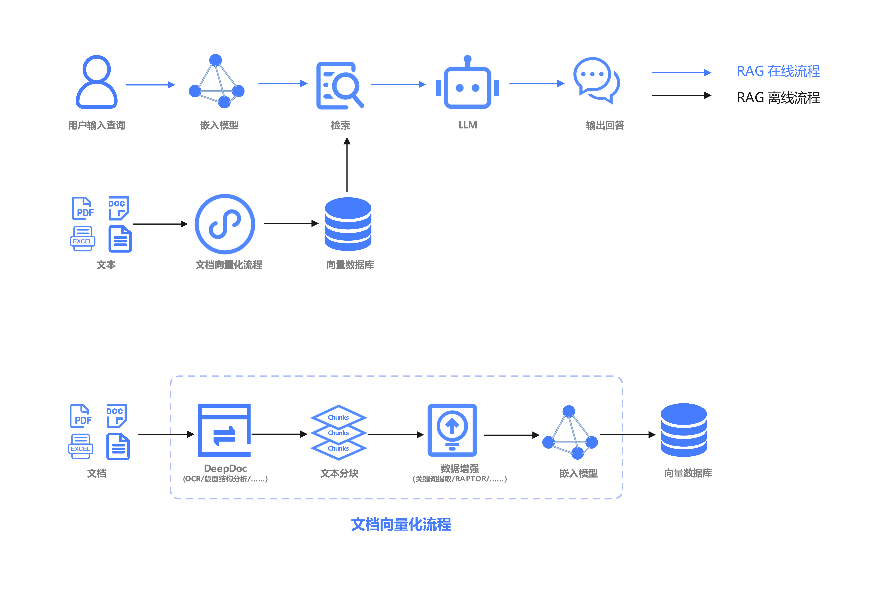

---

瀚博半导体的`vaRAG`是针对一体机和工作站场景的 RAG 解决方案示例，其实际应用效果需根据具体使用场景进行定制和优化。

- offline : file -> `Parse` -> `Chunking` -> `Embedding` -> DB
- online : query -> `Embedding` -> `Rough Ranking` -> `Re-Ranking` -> `LLM` -> Response

基于瀚博一体机、工作站产品，考虑其硬件特性，针对性提出`Entry`、`Base`、`Fully`三种不同的 RAG 解决方案。

- [`Entry`版本](./arch/Entry/README.md)主要针对搭载一张或两张VA1L的工作站场景。在该场景下，所支持的大模型包括Qwen3系列模型。其中，大模型部署于VA1L上，而Embedding模型则部署在CPU端。

- [`Base`版本](./arch/Base/README.md)主要针对搭载八张VA16的一体机场景。在该场景下，所支持的大模型包括DS3系列和Qwen3系列。其中，DS3系列、Qwen3系列大模型部署在VA16加速卡上。而Embedding模型和Rerenk 模型可根据实际情况部署在CPU端或VA16上。
   - 如果大模型为DS3系列模型，则Embedding模型和Rerenk模型只能部署在CPU端。

   - 如果大模型为DS3系列模型，则Embedding模型和Rerenk模型可根据实际情况部署在CPU端或VA16上。

- [`Fully`版本](./arch/Fully/README.md)主要针对搭载八张VA16和四张L2的一体机场景。在该场景下，所支持的大模型包括DS3系列和Qwen3系列。其中，DS3系列、Qwen3系列大模型部署在VA16加速卡上；Embedding模型、Rerank模型以及Query任务、NL2SQL任务所需的模型部署在L2上。

## 📄 Documentation

**❓ [FAQ](./docs/faq.md)** 

## 使用许可
- `vaRAG`遵循[Apache 2.0](LICENSE)许可证许可。
- 项目基于[`dify`](https://github.com/langgenius/dify/tree/main)、[`ragflow`](https://github.com/infiniflow/ragflow)框架部署。其中`dify`框架允许商业用途，包括作为其他应用的后端服务或企业的应用开发平台。若涉及**多租户服务**以及**LOGO与版权信息**，需获取商业许可。