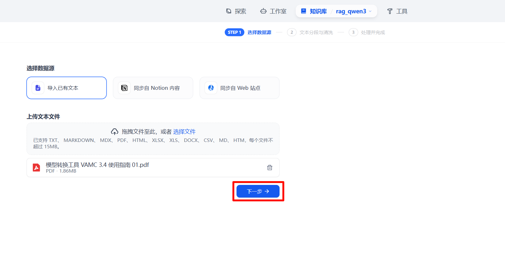

## Entry

`Entry`版本主要针对搭载一张或两张VA1L的工作站场景。在该场景下，所支持的大模型包括Qwen3系列模型。其中，大模型部署于VA1L上，而Embedding模型则部署在CPU端。


### 环境要求

- CPU: Intel CPU
- CPU >= 128核
- RAM >= 512 GB
- Docker >= 24.0.0 
- Docker Compose >= v2.26.1


### 安装Docker

```bash
sudo apt-get update

# 安装 apt 依赖包
sudo apt-get install \
    apt-transport-https \
    ca-certificates \
    curl \
    gnupg-agent \
    software-properties-common
    
# 添加 Docker 的官方 GPG 密钥
sudo curl -fsSL https://mirrors.ustc.edu.cn/docker-ce/linux/ubuntu/gpg -o /etc/apt/keyrings/docker.asc

# 使用以下指令设置稳定版仓库
echo \
  "deb [arch=$(dpkg --print-architecture) signed-by=/etc/apt/keyrings/docker.asc] https://mirrors.ustc.edu.cn/docker-ce/linux/ubuntu/ \
 $(. /etc/os-release && echo "$VERSION_CODENAME") stable" | \
  sudo tee /etc/apt/sources.list.d/docker.list > /dev/null
 
sudo apt-get update

# 安装最新版本的 Docker Engine-Community 和 containerd 
sudo apt-get install docker-ce docker-ce-cli containerd.io

docker --version
# Docker version 28.1.1, build 4eba377
```

### 安装Docker-compose

Docker Compose需高于v2.26.1版本，以下为安装方法。

```bash
sudo curl -L "https://github.com/docker/compose/releases/download/v2.26.1/docker-compose-linux-$(uname -m)" -o /usr/bin/docker-compose

sudo chmod +x /usr/bin/docker-compose

docker-compose --version
# Docker Compose version v2.26.1
```

docker-compose命令详解如下：

```bash
docker-compose up -d   # 重新构建镜像并启动
docker-compose down    # 停止并删除旧容器（如果存在）
docker-compose stop    # 停止容器（保留容器）
docker-compose start   # 后续重新启动
docker-compose logs -f vacc_ds3 # 查看logs
```

### 安装Driver

```bash
sudo apt-get install make cmake

# cmake version 3.22.1
# GNU Make 4.3

sudo chmod a+x vastai_driver_install_d3_3_v2_7_a3_0_9c31939_00.25.08.11.run

sudo ./vastai_driver_install_d3_3_v2_7_a3_0_9c31939_00.25.08.11.run install --setkoparam "dpm=1"

```

###  启动模型服务


>以下模型服务示例以 `x86 架构` 为例，ARM 架构的配置方法类似，具体请参考 [ARM 架构配置说明](./docker_model_arm/)。

**Note:** 模型服务端口可在模型服务yaml文件中查看

#### 启动Embedding模型服务

Embedding模型部署在CPU端。

以bge-m3为例进行说明。
> [bge-m3](https://huggingface.co/BAAI/bge-m3)模型可从huggingface上进行下载。
1. 配置模型参数。

    a. 在`docker_model/docker_text2vec/.env`文件中配置模型路径等参数。

    ```
    # 基础路径
    HOST_DATA_DIR=/vastai/

    # 镜像设置
    TEXT2VEC_CPU_IMAGE=xprobe/xinference:v1.4.0-cpu

    # CPU端模型参数设置
    instance_nums=4
    embed_cpu_model_name=bge-m3
    embed_cpu_model_path=bge-m3
    ```

    b. 执行`source .env`使配置文件生效。

2. 通过docker-compose启动镜像。

   
   ```
   sudo docker-compose -f docker_model/docker_text2vec/docker-compose-cpu.yaml up -d
   ```

#### 启动Qwen3系列模型服务

Qwen3系列模型部署在VA1L上。

以Qwen3-30B-A3B-Thinking-2507-FP8为例进行说明。

1. 配置模型参数。

    a. 在`docker_model/docker_qwen3/.env`文件中配置模型路径等参数。

    ```
    # 基础路径
    HOST_DATA_DIR=/vastai/
    # 镜像设置
    xinfer_vacc_IMAGE=harbor.vastaitech.com/ai_deliver/xinference_vacc_151:AI3.0_SP9_0811
    # 参数设置
    model_name=qwen3
    model_path=Qwen3-30B-A3B-Thinking-2507-FP8
    # GPU_PARIS的列表数量=TP*instance_nums。TP只能为2或4。GPU_PARIS 表示卡Die ID 列表。
    # 对于单卡，TP只能为2，instance_nums只能设置为1。
    # 对于双卡，TP可为2 或 4。如果TP为2，instance_nums可设置为1 或2；如果TP为4，instance_nums只能设置为1。
    GPU_PAIRS=0,1
    instance_nums=1
    ```

    b. 执行`source .env`使配置文件生效。

2. 通过docker-compose启动镜像。
  
   -  如果TP为4，则执行如下指令。
   ```
   # Qwen3系列，TP=4
   sudo docker-compose -f docker_model/docker_qwen3/docker-compose-think-tp4.yaml up -d
   ```
   -  如果TP为2，则执行如下指令。
   
   ```
   # Qwen3系列，TP=2
   sudo docker-compose -f docker_model/docker_qwen3/docker-compose-think-tp2.yaml up -d
   ```
   >若模型为非思考模型`Qwen3-30B-A3B-Instruct-2507-FP8`,则需要使用不带`-think`的docker-compose文件。

3. 测试模型服务。

    ```bash
    curl -X POST "http://localhost:9997/v1/chat/completions" \
    -H "Content-Type: application/json" \
    -d '{
        "model": "qwen3",
        "messages": [
        {"role": "user", "content": "Tell me a joke about AI"}
        ],
        "temperature": 0.7,
        "max_tokens": 200,
        "stream": true
    }'
    ```

### RAG with Dify

#### 启动Dify服务

   ```bash
   cd docker_dify
   sudo docker-compose up -d
   ```

在浏览器输入`http://ip/install`启动服务后，配置账户名及密码。

   ```
   admin@vastai.com / admin / dify@123.
   ```
#### 接入模型

1. 选择模型供应商。


2. 添加Embedding模型。

> `模型名称`和`API endpoint URL`需要和启动模型服务时配置的参数一致。具体参考[启动模型服务](./docker_model/docker_text2vec/docker-compose-cpu.yaml)。


3. 添加LLM模型。

> `模型名称`和`API endpoint URL`需要和启动模型服务时配置的参数一致。具体参考[启动模型服务](./docker_model/docker_qwen3/docker-compose-think-tp4.yaml)。


> 配置LLM模型参数时需要把`流模式返回结果的分隔符`设置成`\r\n\r\n`。


#### RAG应用

1. 创建知识库。

    

2. 选择数据源。

    

3. 导入本地文本。

    

4. 配置知识库。

    

5. 等待创建向量知识库。

    

6. 召回测试。

    

7. 导入[DSL](./config/RAG-Entry.yml)。

    

8. 更新编排中的LLM模型服务。

    

9. 添加知识库并发布应用。

    


10. 应用对话示例。

    
