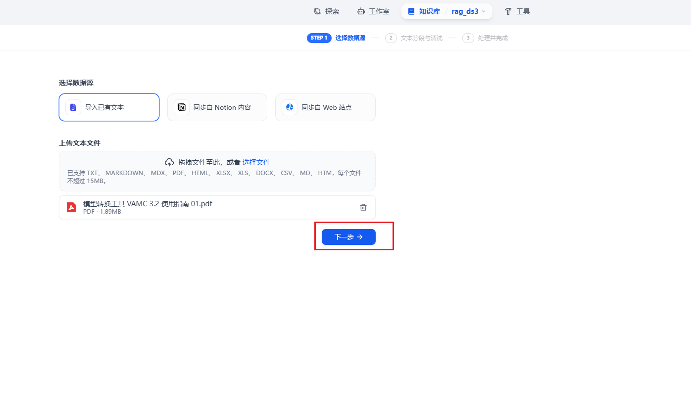
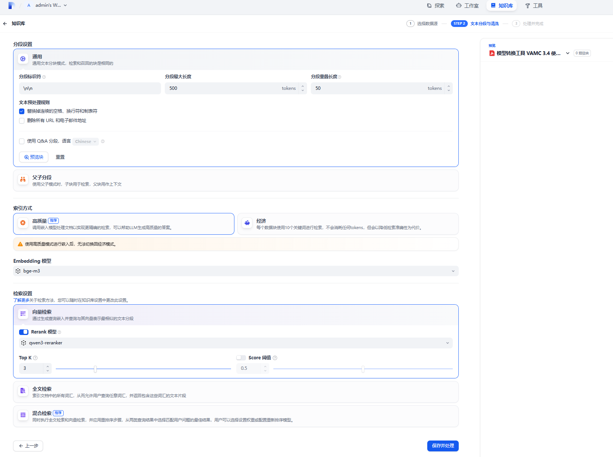
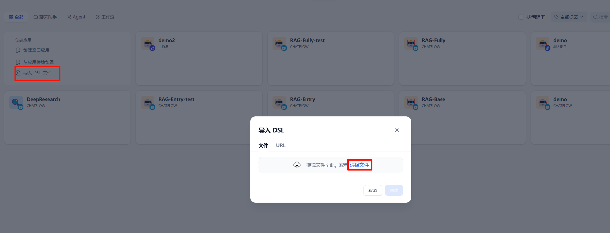
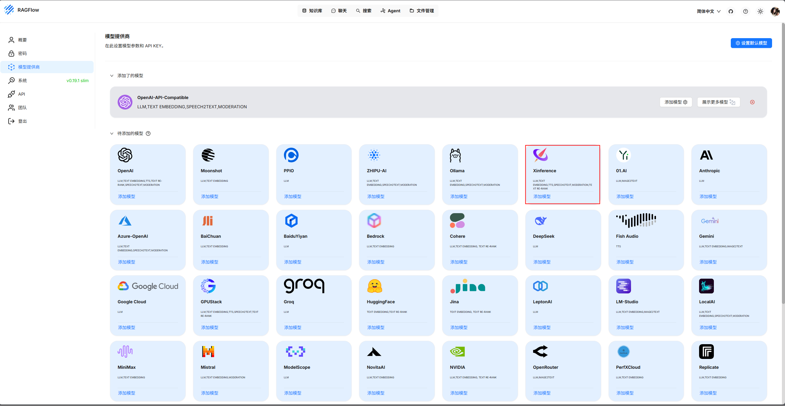
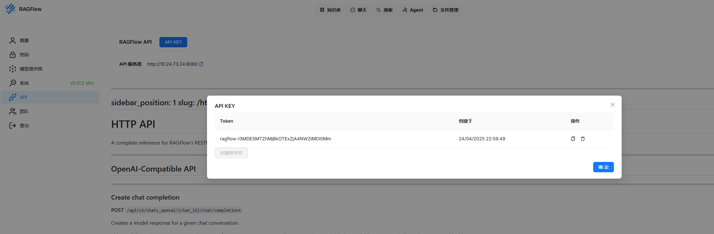
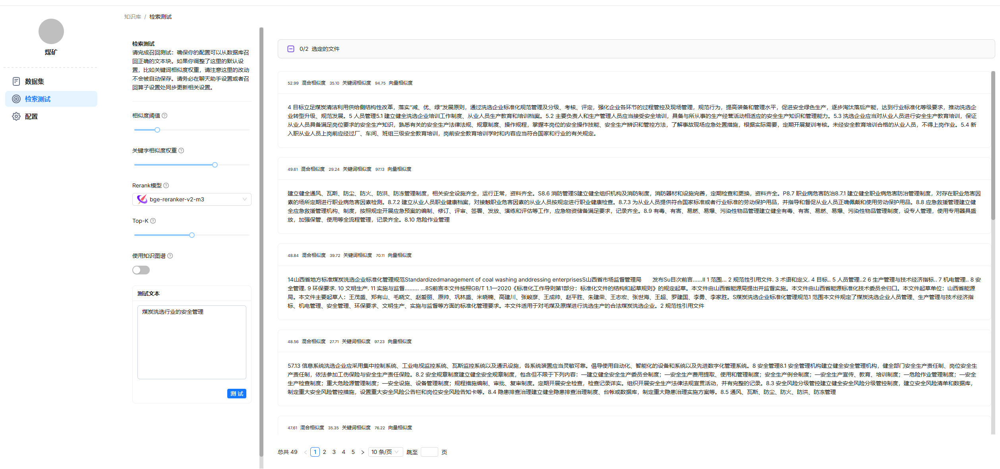
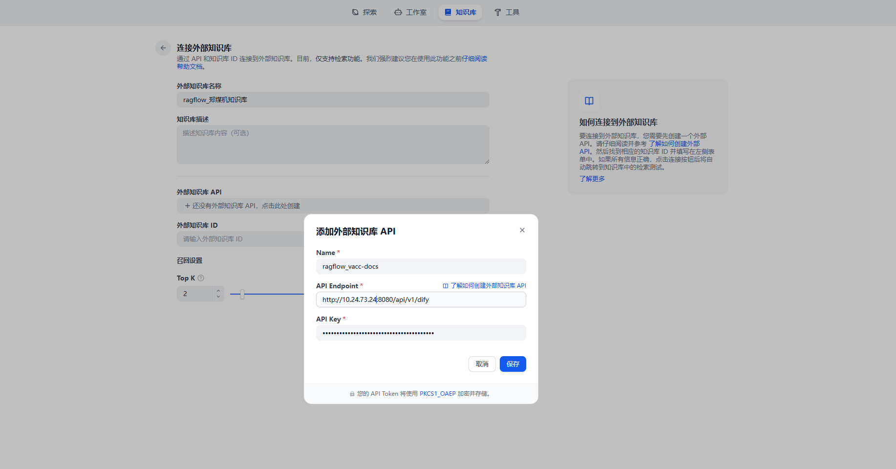

## Fully

`Fully`版本主要针对搭载八张VA16和四张L2的一体机场景。在该场景下，所支持的大模型包括DS3系列和Qwen3系列。其中，DS3系列、Qwen3系列大模型部署在VA16加速卡上；Embedding模型、Rerank模型、以及Query任务、NL2SQL任务所需的模型部署在L2上。

### DS3系列方案架构


### Qwen3系列方案架构


### 环境要求

- CPU: intel
- CPU >= 128核
- RAM >= 512 GB
- Docker >= 24.0.0 & Docker Compose >= v2.26.1


### 安装Docker

```bash
sudo apt-get update

# 安装 apt 依赖包
sudo apt-get install \
    apt-transport-https \
    ca-certificates \
    curl \
    gnupg-agent \
    software-properties-common
    
# 添加 Docker 的官方 GPG 密钥
sudo curl -fsSL https://mirrors.ustc.edu.cn/docker-ce/linux/ubuntu/gpg -o /etc/apt/keyrings/docker.asc

# 使用以下指令设置稳定版仓库
echo \
  "deb [arch=$(dpkg --print-architecture) signed-by=/etc/apt/keyrings/docker.asc] https://mirrors.ustc.edu.cn/docker-ce/linux/ubuntu/ \
 $(. /etc/os-release && echo "$VERSION_CODENAME") stable" | \
  sudo tee /etc/apt/sources.list.d/docker.list > /dev/null
 
sudo apt-get update

# 安装最新版本的 Docker Engine-Community 和 containerd 
sudo apt-get install docker-ce docker-ce-cli containerd.io

docker --version
# Docker version 28.1.1, build 4eba377
```

### 安装Docker-compose

Docker Compose需高于v2.26.1版本，以下为安装方法。

```bash
sudo curl -L "https://github.com/docker/compose/releases/download/v2.26.1/docker-compose-linux-$(uname -m)" -o /usr/bin/docker-compose

sudo chmod +x /usr/bin/docker-compose

docker-compose --version
# Docker Compose version v2.26.1
```

docker-compose命令详解如下：

```bash
docker-compose up -d   # 重新构建镜像并启动
docker-compose down    # 停止并删除旧容器（如果存在）
docker-compose stop    # 停止容器（保留容器）
docker-compose start   # 后续重新启动
docker-compose logs -f vacc_ds3 # 查看logs
```

### 安装Driver

```bash
sudo apt-get install make cmake

# cmake version 3.22.1
# GNU Make 4.3

sudo chmod a+x vastai_driver_install_d3_3_v2_7_a3_0_9c31939_00.25.08.11.run

sudo ./vastai_driver_install_d3_3_v2_7_a3_0_9c31939_00.25.08.11.run install --setkoparam "dpm=1"

```

### 启动模型服务

>以下模型服务示例以 `x86 架构` 为例，ARM 架构的配置方法类似，具体请参考 [ARM 架构配置说明](./docker_model_arm/)。

**Note:** 模型服务端口可在模型服务yaml文件中查看

#### 启动DS3系列模型服务

以DeepSeek-V3为例进行说明。

1. 配置模型参数。
    
    a. 在`docker_model/docker_ds3/.env`文件中配置模型路径等参数。

    ```
    # change model path

    HOST_DATA_DIR=/vastai/
    DS3_IMAGE=harbor.vastaitech.com/ai_deliver/xinference_vacc:AI3.0_SP9_0811   
    ```

    b. 执行`source .env`使配置文件生效。

2. 通过docker-compose启动镜像。


  - 如果开启MTP，则执行如下指令。
   ```BASH
   # DS3系列,开mtp
   sudo docker-compose -f docker_model/docker_ds3/docker-compose-mtp.yaml up -d
   ```

  - 如果不开启MTP，则执行如下指令。

   ```BASH
   # DS3系列,不开mtp
   sudo docker-compose -f docker_model/docker_ds3/docker-compose.yaml up -d
   ```

3. 验证模型服务。

    ```
    curl http://localhost:9998/v1/chat/completions \
    -H "Content-Type: application/json" \
    -d '{
        "model": "deepseek-v3",
        "messages": [
        {"role": "user", "content": "写一首七言绝句，主题为比熊"}
        ],
        "temperature": 0.5
    }'
            
    #{"id":"chatcmpl-ae8fd45507a7417dbb46b5c3469aca5f","object":"chat.completion""created":1751447682,"model":"deepseek-v3","choices":[{"index":0,"message"{"role":"assistant","reasoning_content":null,"content":"《咏比熊犬》  \n雪绒团卧玉前，  \n巧笑追风绕膝旋。  \n莫道此身无勇力，  \n蓬松尾扫一方天。  \n\n注：诗中“雪绒”喻熊犬洁白蓬松的毛发，“巧笑”拟其欢悦神态。尾句以夸张手法展现其尾巴摆动的灵动，暗喻小生灵亦撑开自我天地的气魄，在娇憨中见昂扬之趣。","tool_calls":[]},"logprobs":null"finish_reason":"stop","stop_reason":null}],"usage":{"prompt_tokens":14"total_tokens":117,"completion_tokens":103,"prompt_tokens_details":null}"prompt_logprobs":null}
    ```

#### 启动Qwen3系列模型服务
以Qwen3-30B-A3B-Thinking-2507-FP8为例进行说明。

1. 配置模型参数。
   a. 在`docker_model/docker_qwen3/.env`文件中配置模型路径等参数。

    ```
    # 基础路径
    HOST_DATA_DIR=/vastai/
    # 镜像设置
    xinfer_vacc_IMAGE=harbor.vastaitech.com/ai_deliver/xinference_vacc:AI3.0_SP9_0811
    # 模型参数设置
    model_path=Qwen3-30B-A3B-Thinking-2507-FP8
    # GPU_PARIS的列表数量=TP*instance_nums。TP只能为2或4。GPU_PARIS 表示卡Die ID 列表。
    GPU_PAIRS=0,1,2,3,4,5,6,7,8,9,10,11,12,13,14,15,16,17,18,19,20,21,22,23,24,25,26,27,28,29,30,31
    #tp=4
    instance_nums=8
    #tp=2时，instance_nums=16
    ```

    b. 执行`source .env`使配置文件生效。

2. 通过docker-compose启动镜像。

   -  如果TP为4，则执行如下指令。
   ```BASH
   # Qwen3系列，TP=4
   sudo docker-compose -f docker_model/docker_qwen3/docker-compose-think-tp4.yaml up -d
   ```

   -  如果TP为2，则执行如下指令。
   ```BASH
   # Qwen3系列，TP=2
   sudo docker-compose -f docker_model/docker_qwen3/docker-compose-think-tp2.yaml up -d
   ```
   >若模型为非思考模型`Qwen3-30B-A3B-Instruct-2507-FP8`,则需要使用不带`-think`的docker-compose文件。


3. 测试模型服务。

    ```bash
    curl -X POST "http://localhost:9997/v1/chat/completions" \
    -H "Content-Type: application/json" \
    -d '{
        "model": "qwen3",
        "messages": [
        {"role": "user", "content": "Tell me a joke about AI"}
        ],
        "temperature": 0.7,
        "max_tokens": 200,
        "stream": true
    }'
    ```

### 启动Embedding、Rerank、Query、NL2SQL模型服务

Embedding模型、Rerank模型以及Query任务、NL2SQL任务所需的模型部署在L2上。

1. 配置模型参数。
    在`docker_model/docker_gpu_model/.env`文件中配置模型路径等参数。

    ```
    # image
    VLLM_GPU_IMAGES=docker.amingg.com/vllm/vllm-openai:v0.9.2

    # model directory
    # Note: This directory should be mounted to the container as /weights
    MODEL_DIR=/vastai/

    # nl2sql server
    NL2SQL_SERVER_MODEL=cycloneboy/CscSQL-Grpo-XiYanSQL-QwenCoder-3B-2502
    NL2SQL_SERVER_GPU_USAGE=0.4
    NL2SQL_SERVER_PORT=11221
    NL2SQL_DEVICE_ID=0

    # query server
    QUERY_SERVER_MODEL=Qwen3-1.7B 
    QUERY_SERVER_PGU_USAGE=0.3
    QUERY_SERVER_PORT=11222
    QUERT_DEVICE_ID=1

    # embedding and rerank server
    EMBEDDING_SERVER_MODEL=Qwen3-Embedding-0.6B
    EMBEDDING_SERVER_PORT=11224
    EMBEDDING_DEVICE_ID=0

    RERANK_SERVER_MODEL=Qwen3-Reranker-0.6B
    RERANK_SERVER_PORT=11225
    RERANK_DEVICE_ID=1
    ```

    b. 执行`source .env`使配置文件生效。

2. 通过docker-compose启动镜像。

   ```BASH
   sudo docker-compose -f docker_model/docker_gpu_model/docker-compose.yaml up -d
   ```

3. 参考文档说明启动[mysql-mcp-server服务](../../sample/mysql-mcp-server/README.md)以及生成[`NL2SQL`服务](../../sample/sql_prompt/README.md)所需Prompt。

4. 验证模型服务。

   - 验证qwen3-embedding模型服务。
        ```bash
        curl -X 'POST'   'http://localhost:11224/v1/embeddings' \
        -H 'accept: application/json' \
        -H 'Content-Type: application/json' \
        -d '{                                                                      
            "model": "qwen3-embedding",
            "input": "What is the capital of China?"                                                       
        }'
        ```

   - 验证qwen3-rerank模型服务。

        ```bash
        curl -X 'POST'   'http://localhost:11225/v1/rerank' \
        -H 'accept: application/json' \
        -H 'Content-Type: application/json' \
        -d '{
            "model": "qwen3-reranker",                                                                      
            "query": "A man is eating pasta",                                                 
            "documents": [
            "A man is eating food.", 
            "A man is eating a piece of bread.",
            "The girl is carrying a baby",                                               
            "A man is riding a horse.",                                                       
            "A woman is playing violin."                                                     
            ]                                                                                                                             
        }'
        ```

   - 验证Prompt模型服务。

        ```bash
        curl http://localhost:11222/v1/models

        # {"object":"list","data":[{"id":"prompt_model","object":"model","created":1751596530,"owned_by":"vllm","root":"/weights/Qwen3-1.7B","parent":null,"max_model_len":16384,"permission":[{"id":"modelperm-926df73807824d658f9e3361b866f2a4","object":"model_permission","created":1751596530,"allow_create_engine":false,"allow_sampling":true,"allow_logprobs":true,"allow_search_indices":false,"allow_view":true,"allow_fine_tuning":false,"organization":"*","group":null,"is_blocking":false}]}]}
        ```

### RAG with Dify

#### 启动Dify服务

   ```bash
   cd docker_dify
   sudo docker-compose up -d
   ```

在浏览器输入`http://ip/install`启动服务后，配置账户名及密码。

```
admin@vastai.com / admin / dify@123.
```
#### 接入模型

1. 选择模型供应商。


2. 添加Embedding模型。


3. 添加Rerank模型。


4. 添加LLM模型。以DeepSeek-V3模型为例。


> 配置LLM模型参数时需要把`流模式返回结果的分隔符`设置成`\r\n\r\n`


5. 添加配置`Query服务`模型。


6. 添加`NL2SQL服务`模型。


#### RAG应用

1. 创建知识库。

    

2. 选择数据源。

    

3. 导入本地文本。

    

4. 配置知识库。

    

5. 等待创建向量知识库。

    

6. 召回测试。

    

7. 导入[DSL](./config/RAG-Fully.yml)。

    

8. 添加知识库并发布应用。

    


9. 应用对话示例。

    


### RAGFlow知识库

`RAGFlow`支持PDF中的表格、图片、公式解析，检索准确率显著高于Dify原生方案，且API无缝接入Dify外部知识库

#### 启动RAGFlow服务

```bash
cd docker_ragflow
sudo docker-compose -f docker-compose.yml up -d
```

在浏览器输入`http://ip:8080`启动服务后，配置账户名及密码。

```
admin@vastai.com / admin / ragflow@123.
```

#### RAGFlow配置

1. 配置模型。

    a. 选择模型供应商。

    

   b. 添加LLM模型。
    

   c. 添加Embedding模型。

    

   d. 添加Rerank模型。
    

   e. 设置默认模型。

   

2. 上传知识库文档。

    a. 创建知识库。
    

    b. 配置知识库。

    

    c. 上传数据。

    

    d. 解析数据。

    

3. 创建RAGFlow API密钥。

    

4. 检索测试。
    

5. 记录知识库ID。

    该ID会在Dify连接RAGFlow知识库时使用。

    

#### 通过Dify连接RAGFlow知识库

1. 在Dify平台配置外部知识库API。



2. 连接外部知识库。


