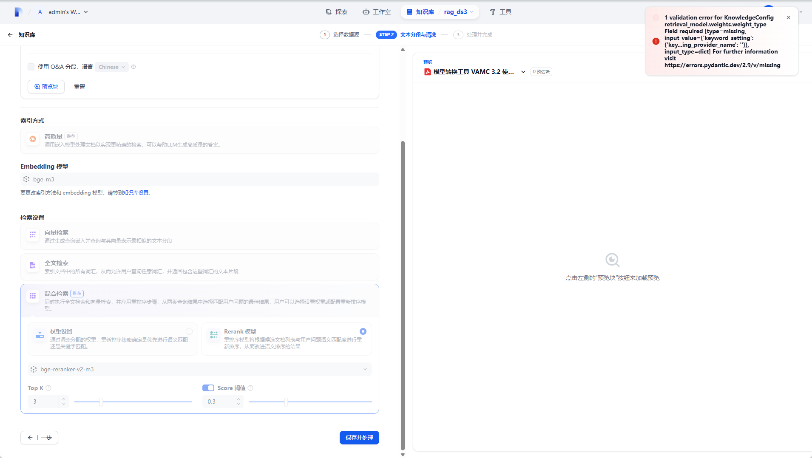

## FAQ

1. 运行服务时，300秒后出现"[openai api compatible]：***Read timed out"错误

    **解决办法**: 此为dify_plugin包llm模型请求的300秒的限制，可以通过修改dify卷中相应代码解除该限制并重启plugin服务，参考[代码](https://github.com/langgenius/dify-plugin-sdks/blob/main/python/dify_plugin/interfaces/model/openai_compatible/llm.py#L471)。

2. 服务经过大模型后无输出，报`Non-JSON encountered`

    **解决办法**: 大模型格式问题，可通过在添加模型服务时通过设置`流模式返回结果的分隔符`为`\r\n\r\n`解决。

3. Dify基于RAGFlow知识库检索效果极差。

    **解决办法**: RAGFlow中基于dify的检索接口默认`vector_similarity_weight`为0.3，可根据业务需求进行调整。进入`ragflow-server`服务中，修改`api/apps/sdk/dify_retrieval.py`代码中对应的`vector_similarity_weight`并重启`ragflow-server`服务。

4. Dify服务中无法正常添加模型，点击保存后无响应。

    **解决办法**: 问题原因可能是`dify_plugin`在安装Python包时由于网络问题安装失败，可在Dify的`.env`配置中修改`PIP_MIRROR_URL=https://pypi.tuna.tsinghua.edu.cn/simple`。

5. Embedding/Rerank模型部署在VA16上运行速度较差。

    **解决思路**: a. 基于va16板卡部署Embedding/Rerank模型时，建议业务中设置model batchsize=1；b. seq len在4096以下（包含4096）时，可选择在VA16部署，反之建议在CPU端部署；c.  基于[VastModelZOO流程](https://github.com/Vastai/VastModelZOO/tree/develop/nlp/text2vec/bge)转模型时，若seq len设置为2048/4096/8192时，建议`attention_split_num`分别设置为0/32/64进一步提升性能

6. Dify第一次构建知识库时设置选择的`混合检索`，那么在知识库中，点击`添加文件`上传第二个文档，然后单击“保存并处理”就会出现错误。

    

    **解决办法**: Dify的[bug](https://github.com/langgenius/dify/pull/16503)，需要更新版本解决。
