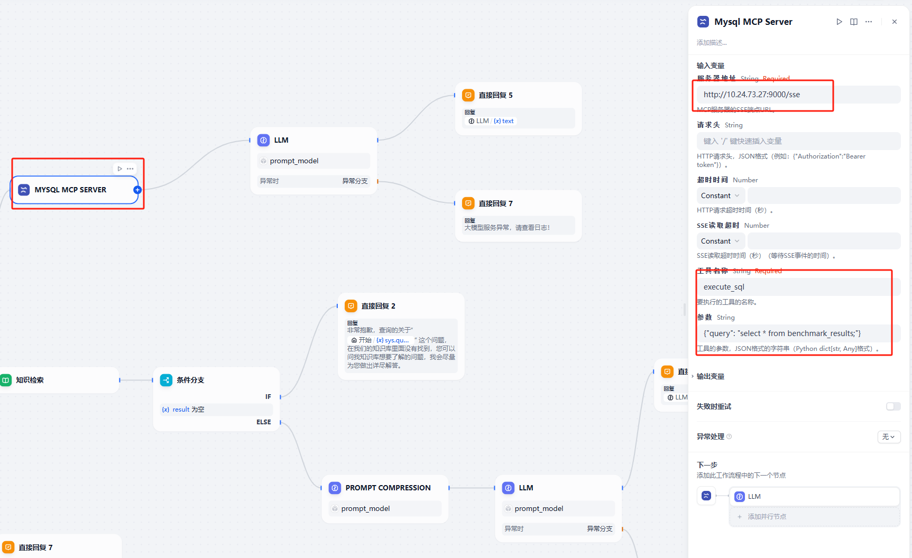

# 启动MySQL MCP服务

`mysql-mcp-server`是基于[项目](https://github.com/wenb1n-dev/mysql_mcp_server_pro)实现的MySQL MCP服务，通过SSE（Server-Sent Events）协议与Dify服务通信，实现对MySQL数据库的动态查询与操作。

## 启动MySQL服务

使用MySQL MCP服务前，需先创建MySQL服务并在数据库中创建表，以下为创建MySQL服务并导入示例数据的流程。

1.  拉取MySQL镜像。

    ```bash
    docker pull harbor.vastaitech.com/ai_deliver/mysql:8.0.39
    ```

2. 启动MySQL服务。

    ```bash
    cd varag/sample/mysql-mcp-server
    sudo docker run -itd --name mysql-test -v `pwd`:/source -p 3308:3306 -e MYSQL_ROOT_PASSWORD=123456 mysql:8.0.39
    ```

    **Note:** 使用`3308`端口是为了防止与RAGFlow服务中的MySQL服务或者其他MySQL服务冲突。

3. 添加示例数据。

    ```bash

    # 进入mysql服务
    sudo docker exec -it  mysql-test bash
    cd /root

    # 输入密码：123456
    mysql -u root -p

    # 创建数据库
    CREATE DATABASE IF NOT EXISTS rag;
    use rag;

    # 创建数据表
    CREATE TABLE IF NOT EXISTS benchmark_results (
        id INT AUTO_INCREMENT PRIMARY KEY,
        max_concurrency INT,
        duration_seconds DECIMAL(10,2),
        successful_requests INT,
        input_tokens INT,
        generated_tokens INT,
        req_throughput DECIMAL(10,2),
        output_token_throughput DECIMAL(10,2),
        total_token_throughput DECIMAL(10,2),
        mean_ttft_ms DECIMAL(10,2),
        mean_tpot_ms DECIMAL(10,2),
        decoding_token_throughput DECIMAL(10,2),
        per_req_decoding_throughput DECIMAL(10,2),
        model_name VARCHAR(100),
        cpu_info VARCHAR(100),
        ai_info VARCHAR(100),
        test_date VARCHAR(50)
    );

    # 导入数据库
    source /source/mysql-data-example/benchmark_results_202506241048.sql;
    ```
## 启动MySQL MCP服务

1. 启动MySQL MCP服务。

    ```bash
    cd docker
    sudo docker-compose up -d
    ```

    **Note:** 启动前可在`docker/docker-compose.yml`文件中确认数据库信息。

2. 接入Dify并在RAG应用中使用。 

   a. 安装插件`使用时配置的MCP工具`。


   b. 创建应用后在应用编排中配置参数。
   
